## Table of Contents


-------------------------------------------------------------------------------------------------------

# In-Vehicle Infotainment (IVI) System

## ITI Graduation Project


Infotainment combines two words – **“information”** and **“entertainment”**. It refers to a system that delivers a combination of information and entertainment services. Infotainment systems connect with all the smart
automotive technologies like ADAS systems, V2X connectivity solutions, telematics devices, smartphones, sensors etc., and integrate them with each other to provide a great driving experience.

Modern in-vehicle systems are truly adding a luxurious touch to vehicles and offering an interactive experience to the driver. Besides playing your favorite song tracks or watching relaxing YouTube videos, you can now also get real-time traffic updates and call/text your loved ones without doing anything. [more](https://www.einfochips.com/blog/everything-you-need-to-know-about-in-vehicle-infotainment-system/).

## Project Features


## Build Linux Image

>Make Sure that you have 150 GB free space in your system

### 1. Download the Layers and BSP

- Create directory called "**yocto**"

  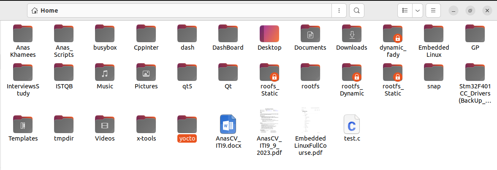 

- Download Poky build system (Kirkstone branch)

  >Go to **yocto** directory and setup the environment 

```
git clone -b kirkstone git://git.yoctoproject.org/poky
```


- Download RaspberryPi Board Support Package **BSP** (Kirkstone branch)

  >Go to poky directory and download the BSP

```
git clone -b kirkstone https://github.com/agherzan/meta-raspberrypi.git 
```

- Download openembedded (kirkstone branch)

```
git clone -b kirkstone https://github.com/openembedded/meta-openembedded.git
```

- Download Qt5 Layer (Kirkstone branch)

```
git clone -b kirkstone https://github.com/meta-qt5/meta-qt5
```


- Setup the Environment 

  ```bash
  source oe-init-build-env 
  ```

  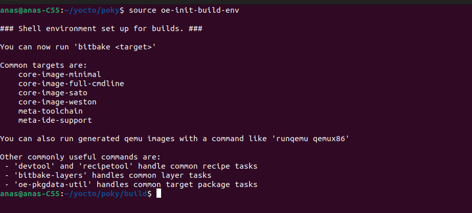

### 2. Add the Layers in *bblayer.conf* file

```c
"/ABSOLUTE/PATH/poky/meta \
 /ABSOLUTE/PATH/poky/meta-poky \
 /ABSOLUTE/PATH/poky/meta-yocto-bsp \
 /ABSOLUTE/PATH/meta-raspberrypi \
 /ABSOLUTE/PATH/meta-openembedded/meta-oe \
 /ABSOLUTE/PATH/meta-openembedded/meta-gnome \
 /ABSOLUTE/PATH/meta-openembedded/meta-xfce \
 /ABSOLUTE/PATH/meta-openembedded/meta-python \
 /ABSOLUTE/PATH/meta-openembedded/meta-networking \
 /ABSOLUTE/PATH/meta-openembedded/meta-multimedia \
 "
```

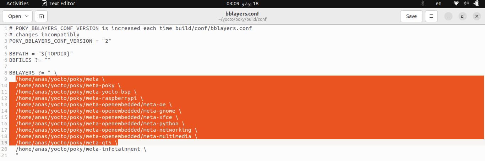

1. **/ABSOLUTE/PATH/poky/meta**:

- **Description**: The core layer provided by the Yocto Project. It contains essential recipes and configuration files for building the core components of the Linux system.
- **Purpose**: Provides the foundational elements and base recipes necessary for building a basic image.

2. **/ABSOLUTE/PATH/poky/meta-poky**:

- **Description**: A reference distribution layer provided by the Yocto Project.
- **Purpose**: Contains example configurations and policies for building Poky, a reference distribution for the Yocto Project.

3. **/ABSOLUTE/PATH/poky/meta-yocto-bsp**:

- **Description**: A BSP (Board Support Package) layer provided by the Yocto Project.
- **Purpose**: Provides support for various hardware platforms, including board-specific configurations and drivers.

4. **/ABSOLUTE/PATH/meta-raspberrypi**:

- **Description**: A BSP layer specifically for the Raspberry Pi platform.
- **Purpose**: Contains recipes and configurations needed to build images for Raspberry Pi boards.

5. **/ABSOLUTE/PATH/meta-openembedded/meta-oe**:

- **Description**: The core OpenEmbedded layer, part of the meta-openembedded collection.
- **Purpose**: Provides a wide range of additional recipes and metadata that are not included in the core Yocto layers.

6. **/ABSOLUTE/PATH/meta-openembedded/meta-gnome**:

- **Description**: An OpenEmbedded layer for GNOME desktop environment components.
- **Purpose**: Provides recipes for building GNOME applications and libraries.

7. **/ABSOLUTE/PATH/meta-openembedded/meta-xfce**:

- **Description**: An OpenEmbedded layer for XFCE desktop environment components.
- **Purpose**: Provides recipes for building XFCE applications and libraries.

8. **/ABSOLUTE/PATH/meta-openembedded/meta-python**:

- **Description**: An OpenEmbedded layer for Python-related recipes.
- **Purpose**: Provides recipes for Python runtime, libraries, and applications.

9. **/ABSOLUTE/PATH/meta-openembedded/meta-networking**:

- **Description**: An OpenEmbedded layer for networking-related recipes.
- **Purpose**: Provides recipes for various networking tools and applications.

10. **/ABSOLUTE/PATH/meta-openembedded/meta-multimedia**:

- **Description**: An OpenEmbedded layer for multimedia-related recipes.
- **Purpose**: Provides recipes for multimedia libraries, codecs, and applications.


### 3. Configure Local.conf File

#### 3.1. Select your target machine ( in my case RPI 3B+) 

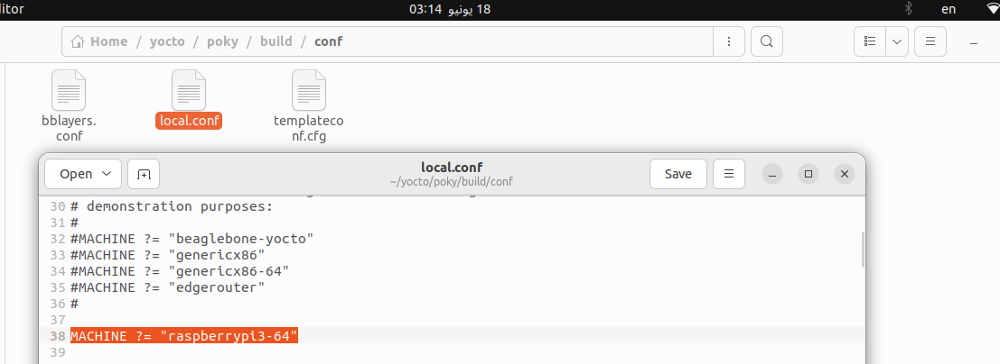


## 3.2. General Configuration

### 1. Core System Configuration

```bash
CONF_VERSION = "2"

DISTRO_FEATURES:append = " systemd"
DISTRO_FEATURES_BACKFILL_CONSIDERED += "sysvinit"
VIRTUAL-RUNTIME_init_manager = "systemd"
VIRTUAL-RUNTIME_initscripts = "systemd-compat-units"
IMAGE_INSTALL += " packagegroup-core-boot"
IMAGE_ROOTFS_EXTRA_SPACE = "5242880"
```

- **CONF_VERSION**: Specifies the configuration version.
- **DISTRO_FEATURES**: Enables features in the distribution. Here, `systemd` is appended, and `sysvinit` is considered as a fallback.
- **VIRTUAL-RUNTIME_init_manager**: Specifies `systemd` as the virtual runtime init manager.
- **VIRTUAL-RUNTIME_initscripts**: Compatibility units for systemd.
- **IMAGE_INSTALL**: Lists packages to be included in the image, including core boot packages and additional tools.
- **IMAGE_ROOTFS_EXTRA_SPACE**: Allocates extra space for the root filesystem.

### 2. QT Configuration

```bash
IMAGE_INSTALL:append = " make cmake"
IMAGE_INSTALL:append = " qtbase-tools qtbase qtdeclarative qtimageformats qtmultimedia qtquickcontrols2 qtquickcontrols qtbase-plugins cinematicexperience liberation-fonts"
PACKAGECONFIG_FONTS:pn-qtbase = " fontconfig"
```

- Installs build tools (`make` and `cmake`) and a suite of Qt libraries and plugins.
- Configures font support for Qt applications using `fontconfig`.

### 3. MP3 Configuration

```bash
IMAGE_INSTALL:append = " gstreamer1.0-plugins-good gstreamer1.0-plugins-base gstreamer1.0-plugins-ugly"
LICENSE_FLAGS_ACCEPTED:append = " commercial  commercial_gstreamer1.0-plugins-ugly"
PACKAGECONFIG:pn-qtmultimedia = " gstreamer alsa"
```

- Installs GStreamer plugins for MP3 support (`good`, `base`, `ugly`).
- Accepts commercial licenses for the specified plugins.

### 4. Bluetooth and Audio Configuration

```bash
DISTRO_FEATURES:append = " pulseaudio"
IMAGE_INSTALL:append = " pulseaudio pulseaudio-module-dbus-protocol pulseaudio-server pulseaudio-module-bluetooth-discover pulseaudio-module-bluetooth-policy pulseaudio-module-bluez5-device pulseaudio-module-bluez5-discover alsa-utils alsa-plugins"
```

- Adds `pulseaudio` and related modules for audio support.
- Includes ALSA utilities and plugins for audio configuration.

### 5. Debugging and Development Tools

```bash
IMAGE_INSTALL:append = " strace"
EXTRA_IMAGE_FEATURES += "tools-debug"
```

- Installs `strace` for debugging purposes.

### 6. Bluetooth and Wi-Fi Tools

```bash
bashCopy codeIMAGE_INSTALL:append = " \
    python3 \
    util-linux \
    bluez5 \
    i2c-tools \
    bridge-utils \
    hostapd \
    iptables \
    wpa-supplicant \
    pi-bluetooth \
    bluez5-testtools \
    udev-rules-rpi \
    linux-firmware-ralink \
    linux-firmware-rtl8192ce \
    linux-firmware-rtl8192cu \
    linux-firmware-rtl8192su \
    linux-firmware-rpidistro-bcm43430 \
    psplash \
    psplash-raspberrypi \
"
```

- Installs various Bluetooth (`bluez5`, `pi-bluetooth`) and Wi-Fi (`hostapd`, `wpa-supplicant`) tools and firmware for different wireless chips.

### 7. Additional Features and Configuration for WiFi and Bluetooth

```bash
DISTRO_FEATURES:append = " \
    bluez5 \
    bluetooth \
    wifi \
    pi-bluetooth \
    linux-firmware-bcm43430 \
"

MACHINE_FEATURES:append = " \
    bluetooth \
    wifi \
"

IMAGE_FEATURES:append = " \
    splash \
"
IMAGE_INSTALL:append = " xserver-xorg xf86-video-fbdev xf86-input-evdev xterm matchbox-wm"
```

- Extends distribution features (`bluez5`, `bluetooth`, `wifi`, etc.) and machine-specific features (`bluetooth`, `wifi`).
- Adds image features (`splash`).
- Installs X server components (`xserver-xorg`, `xf86-video-fbdev`, etc.).

### 

## My Local.conf File

```bash
#
# This file is your local configuration file and is where all local user settings
# are placed. The comments in this file give some guide to the options a new user
# to the system might want to change but pretty much any configuration option can
# be set in this file. More adventurous users can look at
# local.conf.sample.extended which contains other examples of configuration which
# can be placed in this file but new users likely won't need any of them
# initially.
#
# Lines starting with the '#' character are commented out and in some cases the
# default values are provided as comments to show people example syntax. Enabling
# the option is a question of removing the # character and making any change to the
# variable as required.

#
# Machine Selection
#
# You need to select a specific machine to target the build with. There are a selection
# of emulated machines available which can boot and run in the QEMU emulator:
#
#MACHINE ?= "qemuarm"
#MACHINE ?= "qemuarm64"
#MACHINE ?= "qemumips"
#MACHINE ?= "qemumips64"
#MACHINE ?= "qemuppc"
#MACHINE ?= "qemux86"
#MACHINE ?= "qemux86-64"
#
# There are also the following hardware board target machines included for 
# demonstration purposes:
#
#MACHINE ?= "beaglebone-yocto"
#MACHINE ?= "genericx86"
#MACHINE ?= "genericx86-64"
#MACHINE ?= "edgerouter"
#

MACHINE ?= "raspberrypi3-64"

#
# Where to place downloads
#
# During a first build the system will download many different source code tarballs
# from various upstream projects. This can take a while, particularly if your network
# connection is slow. These are all stored in DL_DIR. When wiping and rebuilding you
# can preserve this directory to speed up this part of subsequent builds. This directory
# is safe to share between multiple builds on the same machine too.
#
# The default is a downloads directory under TOPDIR which is the build directory.
#

DL_DIR ?= "/home/anas/yocto/downloads"

#
# Where to place shared-state files
#
# BitBake has the capability to accelerate builds based on previously built output.
# This is done using "shared state" files which can be thought of as cache objects
# and this option determines where those files are placed.
#
# You can wipe out TMPDIR leaving this directory intact and the build would regenerate
# from these files if no changes were made to the configuration. If changes were made
# to the configuration, only shared state files where the state was still valid would
# be used (done using checksums).
#
# The default is a sstate-cache directory under TOPDIR.
#

SSTATE_DIR ?= "/home/anas/yocto/sstate-cache"

#
# Where to place the build output
#
# This option specifies where the bulk of the building work should be done and
# where BitBake should place its temporary files and output. Keep in mind that
# this includes the extraction and compilation of many applications and the toolchain
# which can use Gigabytes of hard disk space.
#
# The default is a tmp directory under TOPDIR.
#
#TMPDIR = "${TOPDIR}/tmp"

#
# Default policy config
#
# The distribution setting controls which policy settings are used as defaults.
# The default value is fine for general Yocto project use, at least initially.
# Ultimately when creating custom policy, people will likely end up subclassing 
# these defaults.
#
DISTRO ?= "poky"
# As an example of a subclass there is a "bleeding" edge policy configuration
# where many versions are set to the absolute latest code from the upstream 
# source control systems. This is just mentioned here as an example, its not
# useful to most new users.
# DISTRO ?= "poky-bleeding"

#
# Package Management configuration
#
# This variable lists which packaging formats to enable. Multiple package backends
# can be enabled at once and the first item listed in the variable will be used
# to generate the root filesystems.
# Options are:
#  - 'package_deb' for debian style deb files
#  - 'package_ipk' for ipk files are used by opkg (a debian style embedded package manager)
#  - 'package_rpm' for rpm style packages
# E.g.: PACKAGE_CLASSES ?= "package_rpm package_deb package_ipk"
# We default to rpm:
PACKAGE_CLASSES ?= "package_rpm"

#
# SDK target architecture
#
# This variable specifies the architecture to build SDK items for and means
# you can build the SDK packages for architectures other than the machine you are
# running the build on (i.e. building i686 packages on an x86_64 host).
# Supported values are i686, x86_64, aarch64
#SDKMACHINE ?= "i686"

#
# Extra image configuration defaults
#
# The EXTRA_IMAGE_FEATURES variable allows extra packages to be added to the generated
# images. Some of these options are added to certain image types automatically. The
# variable can contain the following options:
#  "dbg-pkgs"       - add -dbg packages for all installed packages
#                     (adds symbol information for debugging/profiling)
#  "src-pkgs"       - add -src packages for all installed packages
#                     (adds source code for debugging)
#  "dev-pkgs"       - add -dev packages for all installed packages
#                     (useful if you want to develop against libs in the image)
#  "ptest-pkgs"     - add -ptest packages for all ptest-enabled packages
#                     (useful if you want to run the package test suites)
#  "tools-sdk"      - add development tools (gcc, make, pkgconfig etc.)
#  "tools-debug"    - add debugging tools (gdb, strace)
#  "eclipse-debug"  - add Eclipse remote debugging support
#  "tools-profile"  - add profiling tools (oprofile, lttng, valgrind)
#  "tools-testapps" - add useful testing tools (ts_print, aplay, arecord etc.)
#  "debug-tweaks"   - make an image suitable for development
#                     e.g. ssh root access has a blank password
# There are other application targets that can be used here too, see
# meta/classes/image.bbclass and meta/classes/core-image.bbclass for more details.
# We default to enabling the debugging tweaks.
EXTRA_IMAGE_FEATURES ?= "debug-tweaks"

#
# Additional image features
#
# The following is a list of additional classes to use when building images which
# enable extra features. Some available options which can be included in this variable
# are:
#   - 'buildstats' collect build statistics
USER_CLASSES ?= "buildstats"

#
# Runtime testing of images
#
# The build system can test booting virtual machine images under qemu (an emulator)
# after any root filesystems are created and run tests against those images. It can also
# run tests against any SDK that are built. To enable this uncomment these lines.
# See classes/test{image,sdk}.bbclass for further details.
#IMAGE_CLASSES += "testimage testsdk"
#TESTIMAGE_AUTO:qemuall = "1"

#
# Interactive shell configuration
#
# Under certain circumstances the system may need input from you and to do this it
# can launch an interactive shell. It needs to do this since the build is
# multithreaded and needs to be able to handle the case where more than one parallel
# process may require the user's attention. The default is iterate over the available
# terminal types to find one that works.
#
# Examples of the occasions this may happen are when resolving patches which cannot
# be applied, to use the devshell or the kernel menuconfig
#
# Supported values are auto, gnome, xfce, rxvt, screen, konsole (KDE 3.x only), none
# Note: currently, Konsole support only works for KDE 3.x due to the way
# newer Konsole versions behave
#OE_TERMINAL = "auto"
# By default disable interactive patch resolution (tasks will just fail instead):
PATCHRESOLVE = "noop"

#
# Disk Space Monitoring during the build
#
# Monitor the disk space during the build. If there is less that 1GB of space or less
# than 100K inodes in any key build location (TMPDIR, DL_DIR, SSTATE_DIR), gracefully
# shutdown the build. If there is less than 100MB or 1K inodes, perform a hard halt
# of the build. The reason for this is that running completely out of space can corrupt
# files and damages the build in ways which may not be easily recoverable.
# It's necessary to monitor /tmp, if there is no space left the build will fail
# with very exotic errors.
BB_DISKMON_DIRS ??= "\
    STOPTASKS,${TMPDIR},1G,100K \
    STOPTASKS,${DL_DIR},1G,100K \
    STOPTASKS,${SSTATE_DIR},1G,100K \
    STOPTASKS,/tmp,100M,100K \
    HALT,${TMPDIR},100M,1K \
    HALT,${DL_DIR},100M,1K \
    HALT,${SSTATE_DIR},100M,1K \
    HALT,/tmp,10M,1K"

#
# Shared-state files from other locations
#
# As mentioned above, shared state files are prebuilt cache data objects which can be
# used to accelerate build time. This variable can be used to configure the system
# to search other mirror locations for these objects before it builds the data itself.
#
# This can be a filesystem directory, or a remote url such as https or ftp. These
# would contain the sstate-cache results from previous builds (possibly from other
# machines). This variable works like fetcher MIRRORS/PREMIRRORS and points to the
# cache locations to check for the shared objects.
# NOTE: if the mirror uses the same structure as SSTATE_DIR, you need to add PATH
# at the end as shown in the examples below. This will be substituted with the
# correct path within the directory structure.
#SSTATE_MIRRORS ?= "\
#file://.* https://someserver.tld/share/sstate/PATH;downloadfilename=PATH \
#file://.* file:///some/local/dir/sstate/PATH"

#
# Yocto Project SState Mirror
#
# The Yocto Project has prebuilt artefacts available for its releases, you can enable
# use of these by uncommenting the following lines. This will mean the build uses
# the network to check for artefacts at the start of builds, which does slow it down
# equally, it will also speed up the builds by not having to build things if they are
# present in the cache. It assumes you can download something faster than you can build it
# which will depend on your network.
# Note: For this to work you also need hash-equivalence passthrough to the matching server
#
#BB_HASHSERVE_UPSTREAM = "hashserv.yocto.io:8687"
#SSTATE_MIRRORS ?= "file://.* http://sstate.yoctoproject.org/all/PATH;downloadfilename=PATH"

#
# Qemu configuration
#
# By default native qemu will build with a builtin VNC server where graphical output can be
# seen. The line below enables the SDL UI frontend too.
PACKAGECONFIG:append:pn-qemu-system-native = " sdl"
# By default libsdl2-native will be built, if you want to use your host's libSDL instead of 
# the minimal libsdl built by libsdl2-native then uncomment the ASSUME_PROVIDED line below.
#ASSUME_PROVIDED += "libsdl2-native"

# You can also enable the Gtk UI frontend, which takes somewhat longer to build, but adds
# a handy set of menus for controlling the emulator.
#PACKAGECONFIG:append:pn-qemu-system-native = " gtk+"

#
# Hash Equivalence
#
# Enable support for automatically running a local hash equivalence server and
# instruct bitbake to use a hash equivalence aware signature generator. Hash
# equivalence improves reuse of sstate by detecting when a given sstate
# artifact can be reused as equivalent, even if the current task hash doesn't
# match the one that generated the artifact.
#
# A shared hash equivalent server can be set with "<HOSTNAME>:<PORT>" format
#
#BB_HASHSERVE = "auto"
#BB_SIGNATURE_HANDLER = "OEEquivHash"

#
# Memory Resident Bitbake
#
# Bitbake's server component can stay in memory after the UI for the current command
# has completed. This means subsequent commands can run faster since there is no need
# for bitbake to reload cache files and so on. Number is in seconds, after which the
# server will shut down.
#
#BB_SERVER_TIMEOUT = "60"

# CONF_VERSION is increased each time build/conf/ changes incompatibly and is used to
# track the version of this file when it was generated. This can safely be ignored if
# this doesn't mean anything to you.

CONF_VERSION = "2"

DISTRO_FEATURES:append = " systemd"
DISTRO_FEATURES_BACKFILL_CONSIDERED += "sysvinit"
VIRTUAL-RUNTIME_init_manager = "systemd"
VIRTUAL-RUNTIME_initscripts = "systemd-compat-units"
IMAGE_INSTALL += " packagegroup-core-boot"
IMAGE_ROOTFS_EXTRA_SPACE = "5242880"
IMAGE_INSTALL:append = " x11vnc"

#QT configuration
IMAGE_INSTALL:append = " make cmake"
IMAGE_INSTALL:append = " qtbase-tools qtbase qtdeclarative qtimageformats qtmultimedia qtquickcontrols2 qtquickcontrols qtbase-plugins cinematicexperience liberation-fonts"
PACKAGECONFIG_FONTS:pn-qtbase = " fontconfig"
IMAGE_INSTALL:append = " openssh-sftp-server rsync"

#MP3 Config

IMAGE_INSTALL:append = " gstreamer1.0-plugins-good gstreamer1.0-plugins-base gstreamer1.0-plugins-ugly"
LICENSE_FLAGS_ACCEPTED:append = " commercial  commercial_gstreamer1.0-plugins-ugly commercial_gstreamer1.0-plugins-ugly"
PACKAGECONFIG:pn-qtmultimedia = " gstreamer alsa" 

#stream mp3 by blutooth

DISTRO_FEATURES:append = " pulseaudio"
IMAGE_INSTALL:append = " pulseaudio pulseaudio-module-dbus-protocol pulseaudio-server pulseaudio-module-bluetooth-discover pulseaudio-module-bluetooth-policy pulseaudio-module-bluez5-device pulseaudio-module-bluez5-discover alsa-utils alsa-plugins"

#for debugging 
IMAGE_INSTALL:append = " strace"

#for blutooth and Wifi

IMAGE_INSTALL:append = " \
    python3 \
    util-linux \
    bluez5 \
    i2c-tools \
    bridge-utils \
    hostapd \
    iptables \
    wpa-supplicant \
    pi-bluetooth \
    bluez5-testtools \
    udev-rules-rpi \
    linux-firmware \
    iw \
    kernel-modules \
    linux-firmware-ralink \
    linux-firmware-rtl8192ce \
    linux-firmware-rtl8192cu \
    linux-firmware-rtl8192su \
    linux-firmware-rpidistro-bcm43430 \
    linux-firmware-bcm43430 \
    connman \
    connman-client \
    dhcpcd \
    openssh \
    psplash \
    psplash-raspberrypi \
"

DISTRO_FEATURES:append = " \
    bluez5 \
    bluetooth \
    wifi \
    pi-bluetooth \
    linux-firmware-bcm43430 \
    systemd \
    usrmerge \
    ipv4 \
"

MACHINE_FEATURES:append = " \
    bluetooth \
    wifi \
"

IMAGE_FEATURES:append = " \
    splash \
"
IMAGE_INSTALL:append = " xserver-xorg xf86-video-fbdev xf86-input-evdev xterm matchbox-wm"

EXTRA_IMAGE_FEATURES += "tools-debug"

# For Multithreading 

BB_NUMBER_THREADS = "4"
PARALLEL_MAKE = "-j 4"

IMAGE_FSTYPES = "tar.bz2 ext4 rpi-sdimg"

```


## 4. Build the Image 

```bash
bitbake core-image-sato -k
```

>For Create **SDK** Run :
>
>```bash
>bitbake core-image-sato -c populate_sdk
>```

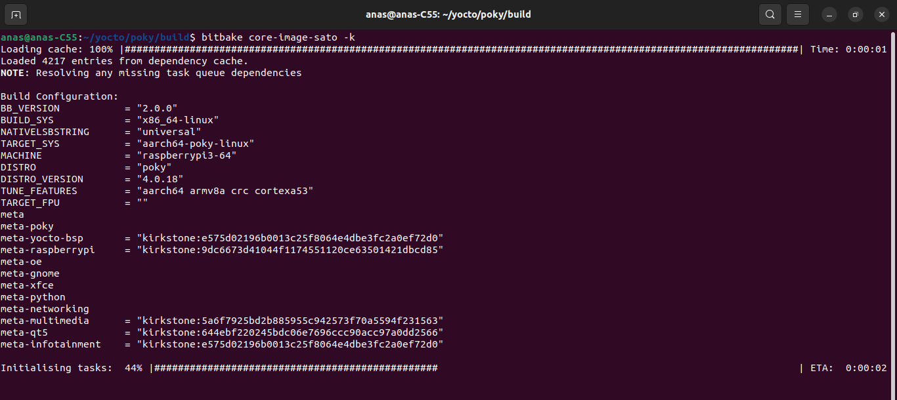

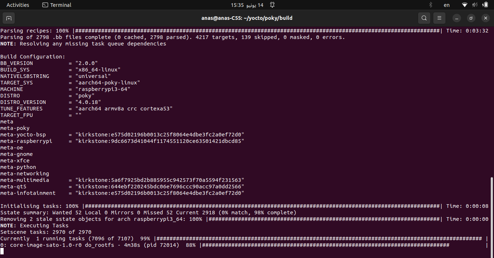

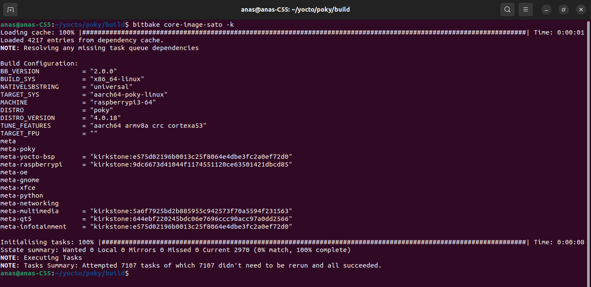


## 5. Flash the Image on SD Card

> Go to **/poky/build/tmp/deploy/images/raspberrypi3-64/**


```bash
bzip2 -d -f core-image-sato-raspberrypi3-64.wic.bz2
```

>Extract and un compress the image  
>
>

>Know the Name of SD card
>
>```bash
>lsblk |grep sd
>```
>
>
>
>

```
sudo dd bs=4M if=core-image-sato-raspberrypi3-64.wic of=/dev/sdc status=progress conv=fsync 
```

>Connect the SD card and  Flash the Image on SD Card


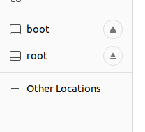

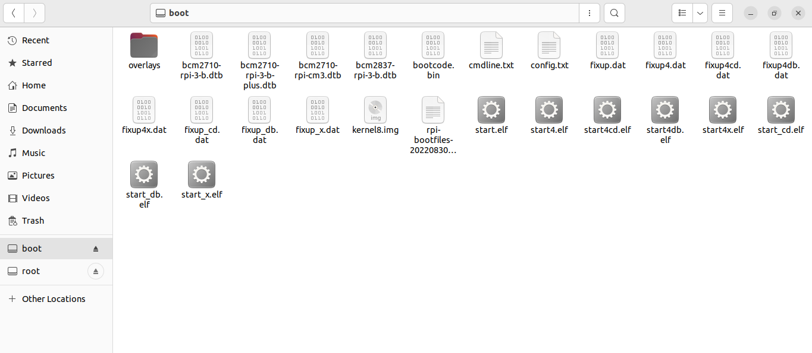

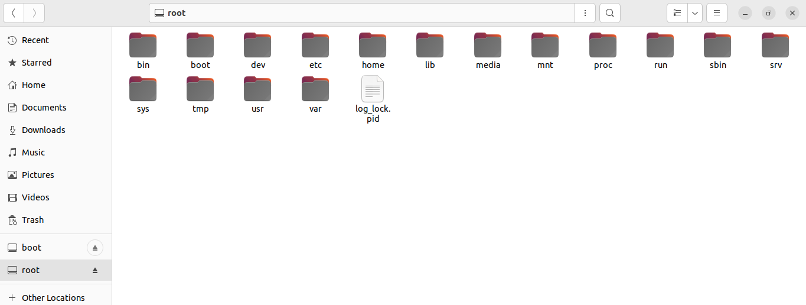


## 6. Graphical User Interface GUI (Qt)

### 6.1. Download Qt

- https://www.qt.io/download-qt-installer-oss


- make the downloaded file executable

  ```
  sudo chmod +x qt-online-installer-linux-x64-4.8.0.run
  ```

  

  ### 6.2. install Qt creator 

  

  


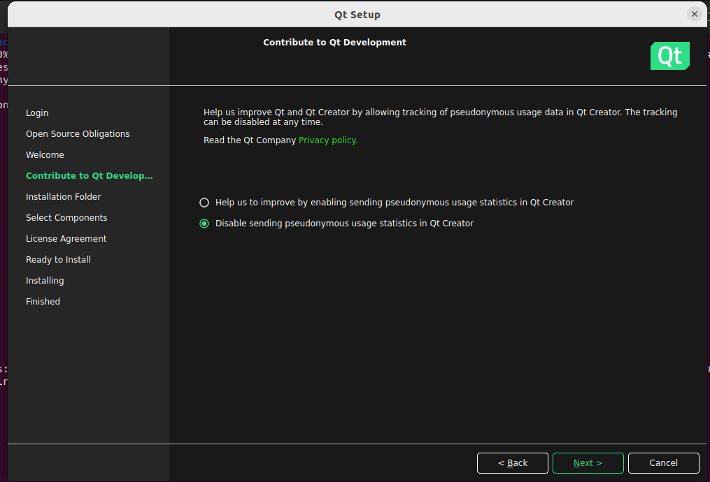


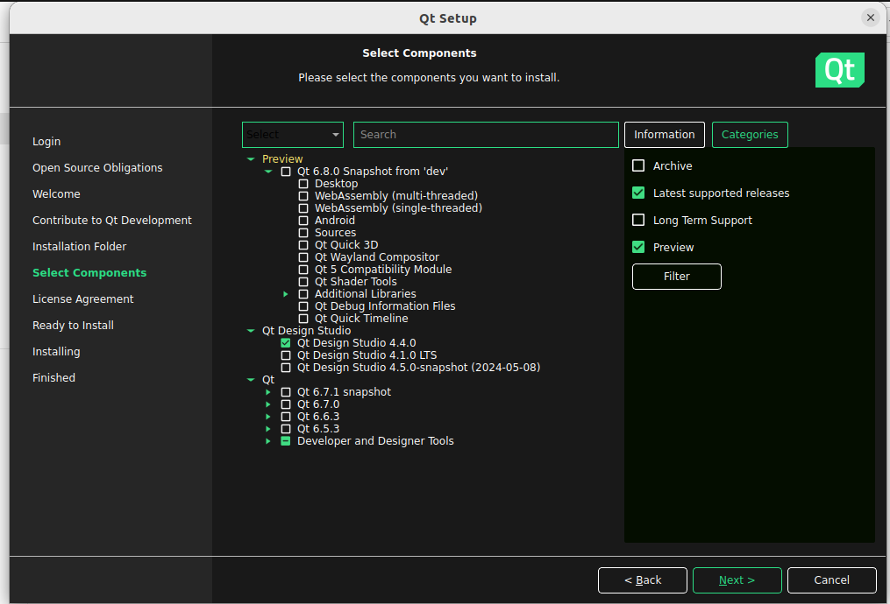

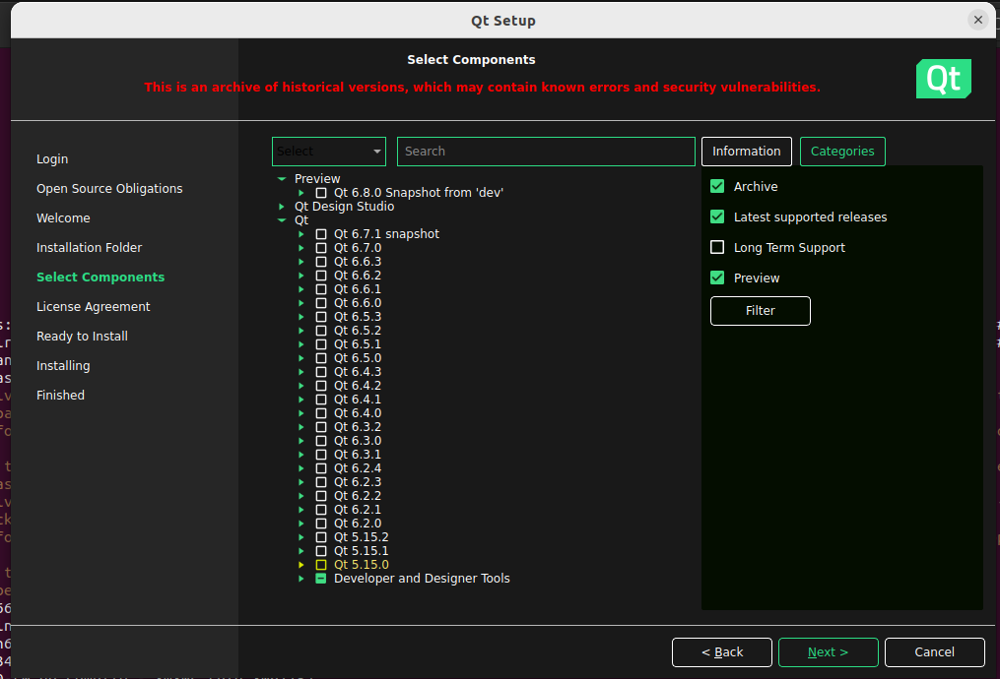

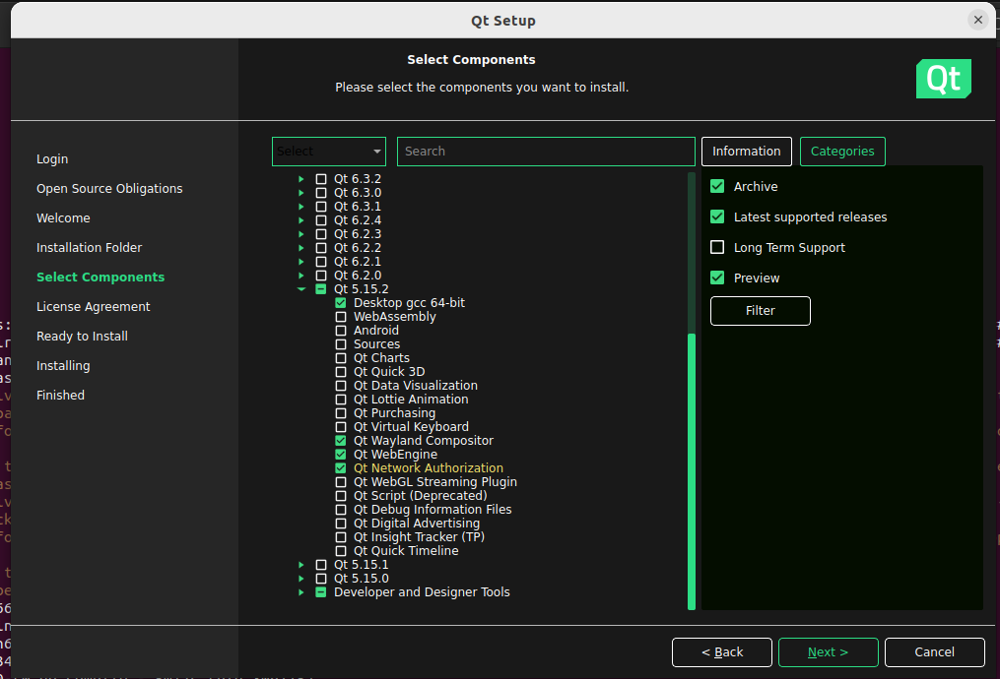

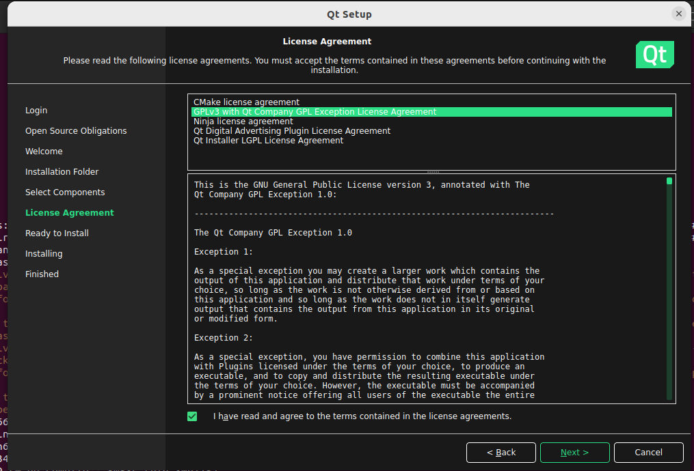

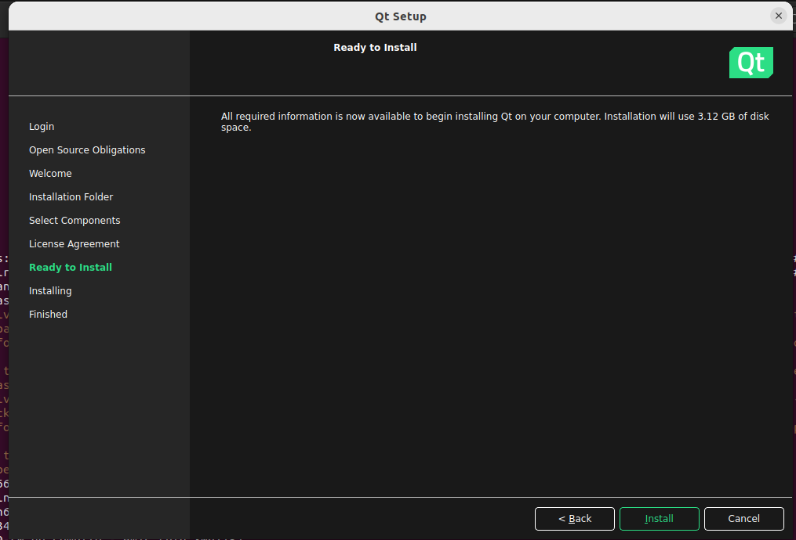

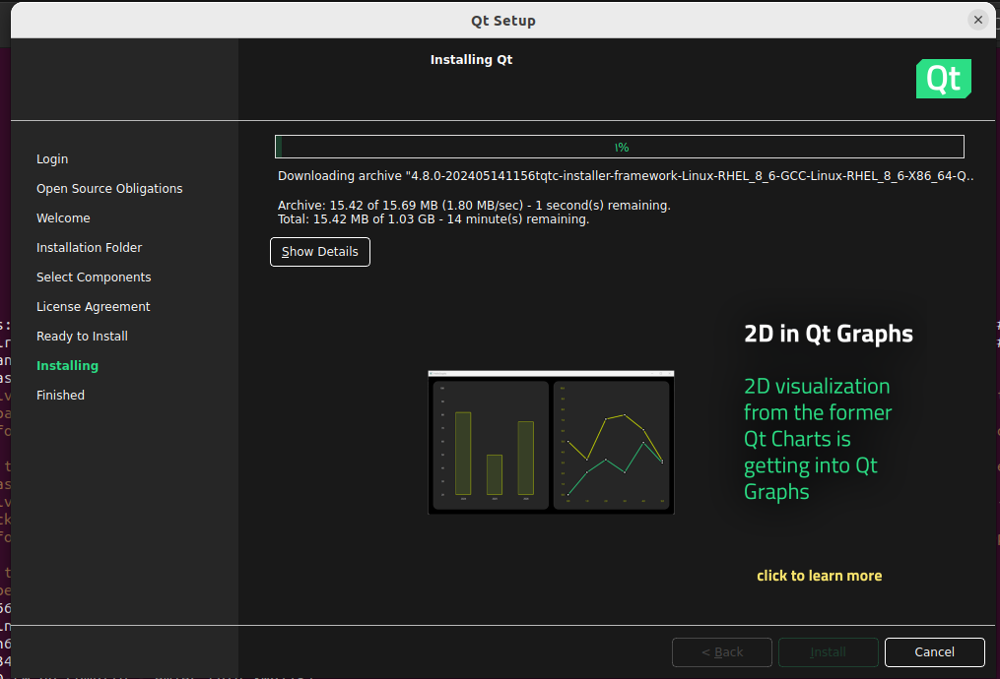

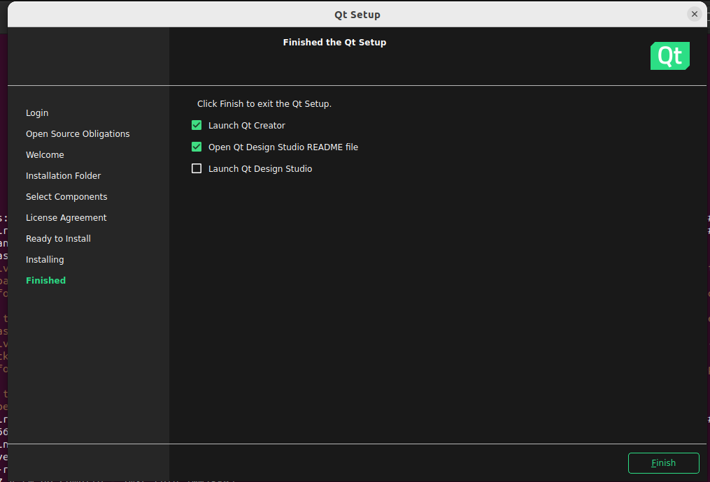

- After finish you may face this warning 

  


> [SOLVED]
>
> ```
> sudo apt-get install libxcb-cursor0
> ```
>
> 


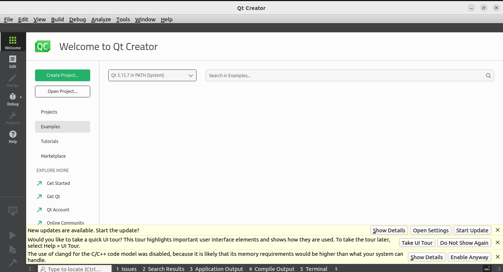

### 6.3. Install Qt5 Tool chain for cross compilation

```bash
bitbake meta-toolchain-qt5  
```

 

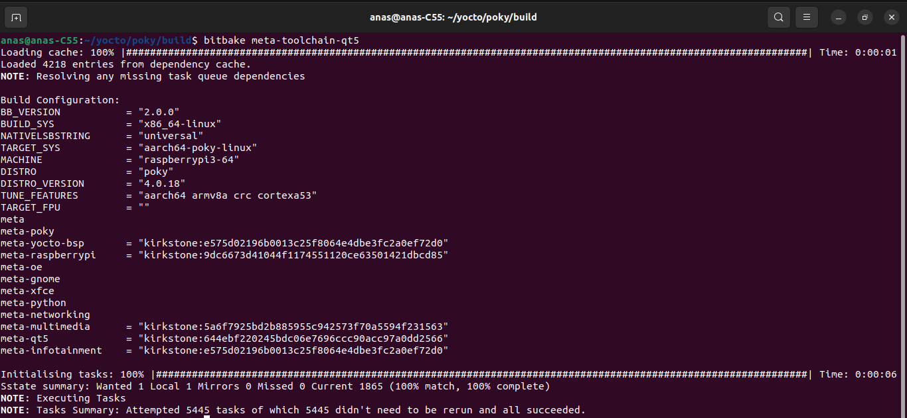

- Go to **cd tmp/deploy/sdk**

```bash
 cd tmp/deploy/sdk
```

- Run the this script

  ```bash
  ./poky-glibc-x86_64-meta-toolchain-qt5-cortex53-raspberrypi3-64-toolchain-4.0.18.sh 
  ```

  


>I select the Path to be : **/home/anas/yocto/poky/build/target**


### 6.4. Configuring the cross compiling and remote deployment settings on Qt creator

- **source the SDK toolchain. The source path may differ depending on the output of your SDK installation**

```bash
source /home/anas/yocto/poky/build/target/environment-setup-cortexa53-poky-linux
```

- **From the same terminal launch qtcreator**

  ```bash
  ~/Qt/Tools/QtCreator/bin/qtcreator 
  ```

  


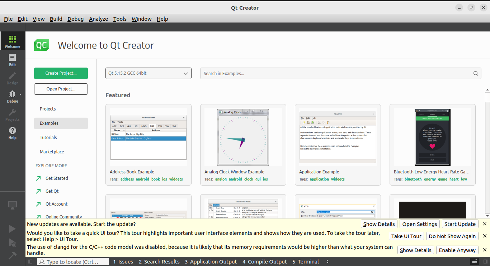

### 6.5. Qt Project Setup

This guide will help you create a new project in Qt Creator that can run on both desktop and Raspberry Pi 3.

**Prerequisites**

- Qt Creator installed on your development machine.
- Qt for Raspberry Pi 3 toolchain installed (for cross-compilation).
- A Raspberry Pi 3 with an appropriate operating system installed.

**Steps to Create a New Qt Project**

1. Open Qt Creator

2. Create a New Project

- Select **File** > **New File or Project** from the menu.
- In the dialog that appears, choose **Application** > **Qt Widgets Application** (or another type of application if needed) and click **Choose...**.
  


3. Set Project Details

- Enter the **Name** and **Location** for your project.
- Click **Next**.
  


4. Define the Project Kit

- Select the kits you want to use. Ensure you select:
  - A desktop kit (e.g., Desktop Qt 5.15.2 GCC 64bit).
  - The Raspberry Pi kit (you should have previously configured this for cross-compilation).
    


5. Configure Project

- Customize the Class Information if needed (e.g., `MainWindow` class details).
- Click **Next**.


6. Write Your Application Code

- Implement your application logic in the generated project files (`main.cpp`, `mainwindow.cpp`, etc.), you can add .h files to Header Files ,and .cpp files to Source Files
- Save your changes.
  


7. Build and Run on Desktop

- Select the desktop kit from the kit selector.
- Click the **Build** button (hammer icon) to compile the project.
- Click the **Run** button (green play icon) to run the application on your desktop.


9. Deploy to Raspberry Pi 3

 **a. Cross-Compile the Project**

1. Select the Raspberry Pi kit from the kit selector.

2. Click the **Build** button to compile the project for Raspberry Pi 3.

   

## 7. Features of Our In-Vehicle Infotainment System

### 1. Music Streaming

**Description**: When the music icon is clicked, the system streams MP3 files from a USB flash drive. It supports pause, continue, playback, repeat, shuffle, volume up, and volume down.

**Required Qt Classes**:

- `QMediaPlayer`: For playing audio files.
- `QMediaPlaylist`: For managing playlists and shuffle/repeat functionality.
- `QFileSystemModel`: To browse files on the USB drive.
- `QListWidget`: To display the list of songs.
- `QDirIterator`, `QDir`, `QUrl`: For handling file directories and URLs.

### 2. Video Streaming

**Description**: When the video icon is clicked, the system streams MP4 files from a USB flash drive. It supports pause, continue, playback, volume control, and other playback features.

**Required Qt Classes**:

- `QMediaPlayer`: For playing video files.
- `QGraphicsVideoItem`: To display the video.
- `QGraphicsScene`: For managing the video display.
- `QRectF`: For defining the video display area.

- `QPushButton`: For control buttons (pause, play, volume up/down, etc.).

### 3. Bluetooth Audio Streaming

**Description**: Supports audio streaming from Bluetooth-enabled devices, allowing users to play music wirelessly.

**Required Qt Classes**:

- `QBluetoothLocalDevice`: To manage the local Bluetooth device.
- `QBluetoothDeviceDiscoveryAgent`: To discover other Bluetooth devices.
- `QBluetoothSocket`: For Bluetooth communication.

### 4. Time and Date Display

**Description**: The system displays the current time and date.

**Required Qt Classes**:

- `QDate`: For handling dates.
- `QTime`: For handling time.
- `QTimer`: To update the display every second.
- `QLabel`: To display the time and date.

### 5. Temperature Display

**Description**: The system displays the current temperature, acquired from OpenWeatherMap.org using API keys.

**Required Qt Classes**:

- `QNetworkAccessManager`: For making HTTP requests to the OpenWeatherMap API.
- `QNetworkReply`: To handle the responses from the API.
- `QJsonDocument`: To parse the JSON data received from the API.
- `QJsonObject`, `QJsonValue`: For JSON data manipulation.
- `QNetworkRequest`: For making the network request.

### 6. Settings

**Description**: The settings menu includes options to change the theme and edit the time and date.

**Required Qt Classes**:

- `QComboBox`: For selecting the theme.
- `QDateTimeEdit`: To edit the date and time.
- `QSettings`: To save and load settings.
- `QPushButton`: For applying changes.

### 7. YouTube Integration

**Description**: When the YouTube icon is clicked, the system opens the YouTube page in the browser.

**Required Qt Classes**:

- `QDesktopServices`: To open URLs in the default web browser.
- `QUrl`: To handle the YouTube URL.
- `QPushButton`: For the YouTube button.
- `QWidget`, `QVBoxLayout`: For layout management.

### 8. Air conditioner 
